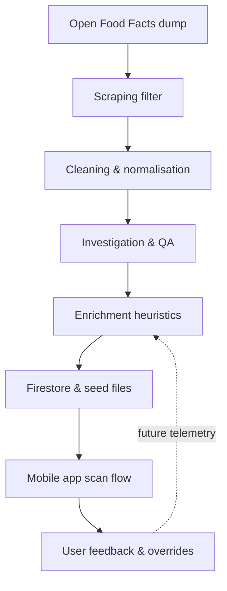

# Food Remedy Data Architecture Overview

## 1. Purpose & Audience
This document is the **entry point for anyone trying to understand how Food Remedy handles data end-to-end**. It explains how raw product feeds from Open Food Facts (OFF) flow through scraping, cleaning, enrichment, persistence, and finally into the mobile experience. Use it to orient new contributors, justify design choices, and know which detailed specs to consult next.

## 2. System Objectives
- **Personalised safety & nutrition guidance** – surface allergens, diet suitability, risk scores per profile.
- **Explainability-first** – every automated judgement must be traceable back to raw data, heuristics, and thresholds.
- **Iterative agility** – keep pipeline components composable so teams can update heuristics, schemas, or storage independently.
- **Operational pragmatism** – use deterministic, rule-based enrichment until labelled data and telemetry justify ML models.

## 3. High-Level Flow
```
Open Food Facts dump → Scraping filter → Cleaning/normalisation → QA & enrichment →
Production datasets (Firestore + seed files) → Mobile app scan flow + backend services
```
Each stage emits a **contracted dataset** with clear guarantees so downstream teams can build confidently.

## 4. Architectural Pillars & Rationale
### 4.1 Rule-Based Enrichment (Current Stage)
- **Data availability** – OFF provides heterogeneous, partially missing fields; there is not yet a reliable corpus of labelled outcomes per profile, so supervised ML would overfit to noisy tags.
- **Safety requirements** – allergen and dietary compliance errors have real-world impact. Deterministic heuristics with explicit negation handling (e.g., dairy-free vs plant milks) are auditable and easier to QA than opaque models.
- **Iteration speed** – heuristics live in small, testable modules such as [mobile-app/services/nutrition/dietLifestyleTagger.js](mobile-app/services/nutrition/dietLifestyleTagger.js) and [mobile-app/services/nutrition/ingredientQualityTagger.js](mobile-app/services/nutrition/ingredientQualityTagger.js), so teams can tune keywords or thresholds via PR without retraining or managing model drift.
- **Future-ready** – enrichment outputs (scores, tags, reasons) are already structured, making them ideal labels once telemetry exists to train ML replacements.
### 4.2 Data Contracts & Guarantees
- **Unique identifiers** – every product is keyed by barcode from the cleaning stage onward.
- **Unit normalisation** – cleaning scripts convert weights (g/ml) and energy (kcal) into canonical units; sodium is converted from salt when needed.
- **Tag hygiene** – language prefixes are stripped (`en:vegan → vegan`), keeping UI chips consistent.
- **Traceability** – enrichment modules return `reasons` payloads explaining why a badge was added or removed, enabling user-facing messaging and QA.

## 5. Stage-by-Stage Overview
| Stage | Location / Scripts | Responsibilities | Output Guarantees | Key References |
| --- | --- | --- | --- | --- |
| **Raw ingestion** | [database/scraping/OpenFoodFacts-DataScrape.py](database/scraping/OpenFoodFacts-DataScrape.py) | Stream OFF dataset, keep Australian products, drop unused fields | `.jsonl` chunks limited to Australian scope, one product per line | [database/DATABASE-README.md](database/DATABASE-README.md) |
| **Cleaning & normalisation** | [database/clean data/cleanProductData.py](database/clean%20data/cleanProductData.py) | Deduplicate, normalise text, coerce numerics, keep relevant nutrients, generate image URLs | JSON with camelCase keys, canonical units, clean tags, required fields ensured (`barcode`, `brand`, `nutriments`) | [database/clean data/cleanProductData.py](database/clean%20data/cleanProductData.py) |
| **Investigation & QA** | [database/data_investigation](database/data_investigation) | Spot-check distributions, validate heuristics, capture anomalies before seeding | EDA notebooks/reports feeding backlog tickets | [database/DATABASE-README.md](database/DATABASE-README.md) |
| **Enrichment heuristics** | [Documents/Database/2025 Trimester 3/dietary-lifestyle-risk-enrichment.md](Documents/Database/2025%20Trimester%203/dietary-lifestyle-risk-enrichment.md) + mobile services | Apply dietary/lifestyle tagging, nutrition scoring, ingredient risk modelling, category harmonisation | Structured tags (`dietTags`, `riskTags`), scores (0–100), additive summaries, conflict reasons | [mobile-app/services/utils/productTags.ts](mobile-app/services/utils/productTags.ts), [mobile-app/services/nutrition/nutritionScorer.ts](mobile-app/services/nutrition/nutritionScorer.ts) |
| **Persistence & delivery** | [database/seeding](database/seeding), Firebase Firestore, Expo mobile app | Seed curated datasets, sync with Firestore collections (`PRODUCTS`, profile data), expose via Expo app + local SQLite cache | Firestore docs keyed by barcode, timestamps (`dateAdded`, `lastUpdated`), contract with FE product schema ([mobile-app/types/Product.ts](mobile-app/types/Product.ts) if available) | [mobile-app/README.md](mobile-app/README.md), [Documents/Project/project-overview.md](Documents/Project/project-overview.md) |

## 6. Integration Touchpoints
- **Mobile scan flow** – Camera module scans barcode → requests Firestore product doc (or local cache) → runs client-side enrichment (`getProductTags`, `dietLifestyleTagger`, `ingredientQualityTagger`) for realtime badges. Contracts defined in [mobile-app/services/utils/productTags.ts](mobile-app/services/utils/productTags.ts).
- **Profile system (FE/BE)** – Household profiles captured via Expo UI write to Firebase/SQLite (see [mobile-app/components/providers/ProfileProvider.tsx](mobile-app/components/providers/ProfileProvider.tsx)). The enrichment layer reads these restrictions to block hazardous products.
- **Seeding & CI** – Cleaned batches inside `database/seeding/products_*` mirror what CI loads into Firestore for demos/tests. Scripts such as `scripts/run_pipeline_ci.sh` orchestrate scraping→cleaning→seeding in automation.
- **API/Contract Layer** – The aggregator service (Firebase functions / Node backends described in [Documents/Project/project-overview.md](Documents/Project/project-overview.md)) exposes REST/GraphQL endpoints consumed by the mobile app for auth, shopping lists, and recommendations.

## 7. Data Guarantees by Stage
1. **Scraping** – Product list is append-only; retries handle HTTP failures; metadata stored with collection timestamp.
2. **Cleaning** – Every record has `barcode`, `productName` (may be `null` but field exists), numerics fall back to `0` or `null` with explicit defaults, tag arrays never `null` (empty array instead).
3. **Enrichment** – Nutrition scores always emit `compositeScore` (0–100). Taggers return both positive and negative assertions (e.g., `Not Vegan`). Missing data is explicitly surfaced via `reasons.missing_data` so FE can display graceful fallbacks.
4. **Persistence** – Firestore writes include audit timestamps; seeding scripts use batches of 500 with exponential backoff, ensuring we never exceed write quotas.
5. **Serving** – Mobile caches respect TTLs; when offline, UI shows last-known risk badges with a “verify when online” toast.

## 8. Known Limitations & Assumptions
- **OFF data lag** – Packaging changes may trail reality; we rely on users to flag mismatches until we ingest crowd-sourced corrections.
- **Sparse ingredients** – Products lacking `ingredients_text` cannot produce certain tags (e.g., low-GI). The pipeline intentionally withholds badges rather than guessing.
- **Australian focus** – Filters drop non-AU items, so travelling users may encounter missing barcodes. Future versions could fall back to global categories.
- **Heuristic brittleness** – Keyword lists require periodic tuning as new additives/labels appear. Automated monitoring (e.g., counting unknown tags) is on the roadmap.
- **No automated feedback loop yet** – User interactions are not fed back into data quality metrics. Planned telemetry will power ML or reinforcement strategies later.

## 9. Future Extensions
- **Labelling telemetry** – Capture user overrides (“mark as unsafe”) to build labelled datasets for ML classification.
- **Hybrid inference** – Use heuristics as guardrails while lightweight models suggest confidence scores for nutrients or missing fields.
- **Real-time manufacturer feeds** – Partner APIs could complement OFF to reduce latency.
- **Data quality dashboard** – Surface pipeline metrics (scrape volume, cleaning drop rates, enrichment coverage) for leadership in one place.

## 10. Cross-Reference Index
| Topic | Detailed Doc |
| --- | --- |
| Contribution process | [README.md](README.md) |
| MVP product narrative & personas | [Documents/Project/project-overview.md](Documents/Project/project-overview.md) |
| Database pipeline specifics | [database/DATABASE-README.md](database/DATABASE-README.md) |
| Enrichment heuristics & risk rules | [Documents/Database/2025 Trimester 3/dietary-lifestyle-risk-enrichment.md](Documents/Database/2025%20Trimester%203/dietary-lifestyle-risk-enrichment.md) |
| Mobile app architecture & setup | [mobile-app/README.md](mobile-app/README.md) |
| Leadership/ticket guidance | [Documents/Guides/Leadership/leadership.md](Documents/Guides/Leadership/leadership.md) |

Use this overview plus the linked references to ramp up quickly or explain the system to stakeholders.

## 11. Operational Checklist & Ownership
| Stage | Owner(s) | Run Cadence | Monitoring hooks |
| --- | --- | --- | --- |
| Scraping | Data/platform team | Monthly full pull, ad-hoc delta when OFF publish updates | Log scrape volume, HTTP failure counts |
| Cleaning | Data team | After each scrape batch | Record dedupe drops, missing-field rates |
| Seeding | Data ↔ infra pair | Before each major demo/release | Track Firestore write errors, batch durations |
| Enrichment tuning | Domain experts + FE | As needed via PRs | Run `dietLifestyleTagger.tests.js`, `ingredientQualityTagger.tests.js`, Expo smoke tests |
| Mobile integration | FE squad | CI + nightly | Expo E2E tests on scan/recommendation flow |

Document adjustments in `/Documents/Database/change-log.md` whenever heuristics/thresholds shift.

## 12. Monitoring & KPI Suggestions
- **Coverage metrics** – % of products with `ingredients_text`, % with full nutrient panels.
- **Badge integrity** – Count of `reasons.missing_data`, number of conflicting tags suppressed.
- **Pipeline latency** – Time from OFF release → cleaned dataset → Firestore availability.
- **Error budgets** – Firestore seeding retries, Expo scan failures referencing missing products.
Expose these KPIs in a lightweight dashboard (Notion, Google Sheet, or Grafana) so leadership can track data quality health over time.

## 13. Roadmap to ML Adoption
1. **Telemetry foundation** – Collect anonymized scan outcomes, user overrides, profile contexts.
2. **Label validation** – Audit heuristic outputs vs human judgement across a representative product set.
3. **Feature store design** – Reuse cleaned/enriched attributes (nutriments, ingredient embeddings) for model input.
4. **Shadow mode** – Run ML models alongside heuristics, compare recommendations without user impact.
5. **Gradual rollout** – Replace individual heuristics (e.g., diabetic-friendly) once ML proves higher precision/recall and remains explainable.

## 14. Visual Architecture (Mermaid)


Use the diagram in presentations or onboarding decks to illustrate how the data engine loops feedback back into enrichment.
